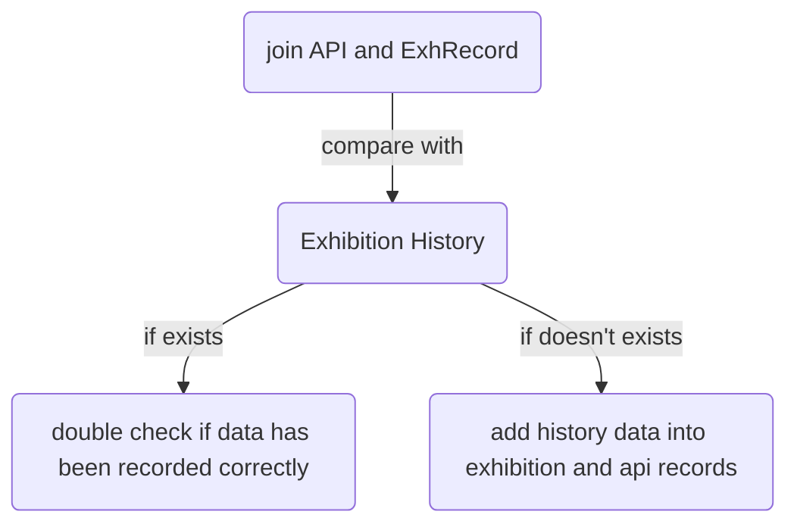

After a month of explore and trying, Professor Brianna c. Heggeseth and I have made some progress in cleaning and linking the exhibition data and object data for Minneapolis Institute of Art. At the beginning of this project, we received messy history data from Mia. And we also got partial completed api data and exhibition data. To assist Mia's work about update and complete the api and exhibition data and eventually abandon the history data, we tired to link exhibition records and objects' info, and report missing matching and update api and exhibition records. 

In this post, I will try to illustrate our work flow and summarize what we have done in this project. But **all specific examples I use in the post do not reflect Mia's actual data but are for the sake of illustrating my learning and working process.**

So, what is the general map of what we have done? 

**Join API & ExhRecord**

We joined the API data and Exhibition Record to double-check for consistency in dates. We converted the Display Date in the API to ISO Dates. We call this joined record as API/ExhRecord.

**Linking API/ExhRecord with Exhibition History text**

**Step 1:** To join the Exhibition History text with the existing API/ExhRecord, we searched the Exhibition History text for existing ExhTitles from the API/ExhRecord. To identify the title in the Exhibition History text, we then put the title in quotes, if it wasn't already, and created an indicator that the title was found in the Exhibition History text of that object. 

**Step 2:**  The Exhibition History text includes information about multiple exhibitions, so we attempted to split the text into individual exhibitions but there were inconsistencies in how that is marked in the history text. We did some manual splits when they didn't follow the general patterns but we are sure that we missed some unique patterns. 

**Step 3:** We joined the API/ExhRecord with the object Exhibition History text of the objects with the title found in the Exhibition History text string. First, we match by start and end year and then I allowed additional matching if the years were off by 1 year. 

**Step 4:** We created subsets of our merged dataset based on characteristics and action items. Eventually, we were able to create indicators for data needs double check, data needs to add to API, and some potential matching we have found but unable to confirm (needs Mia to double check).

To be honest, it has been the hardest data project I have worked on. Because this project involves dirty strings/text in the history data that I did not know how to deal with at the beginning. I have talked about this in detail in another [post](https://jiayingwu.netlify.app/post/working-with-dirty-data/). And it is hard also because, for most of the time, we couldn't join the exhibition records and objects simply by object ID (sometimes missing) or exhibition dates (sometimes roughly off). I have been introduced to join data frames by `fuzzy join` and learned how to find and check data patterns. 

Currently, Mia is checking the work we have done. I hope that they could find these subsets' data useful as they could easily check or add some data to the exhibition records or API records. Personally speaking, I still have a lot to learn about data matching. But this project has opened the door of working with big datasets and historical data (made before 2000) for me.

Now, I have made some progress in working with big data in R:

- [x] find patterns/insights across different data frames
- [x] concepts about `fuzzy join`
- [x] clean dirty data using `stringr`
- [x] make easy-to-read indicators for clients for further work

See you guys in the next post... 🙌
